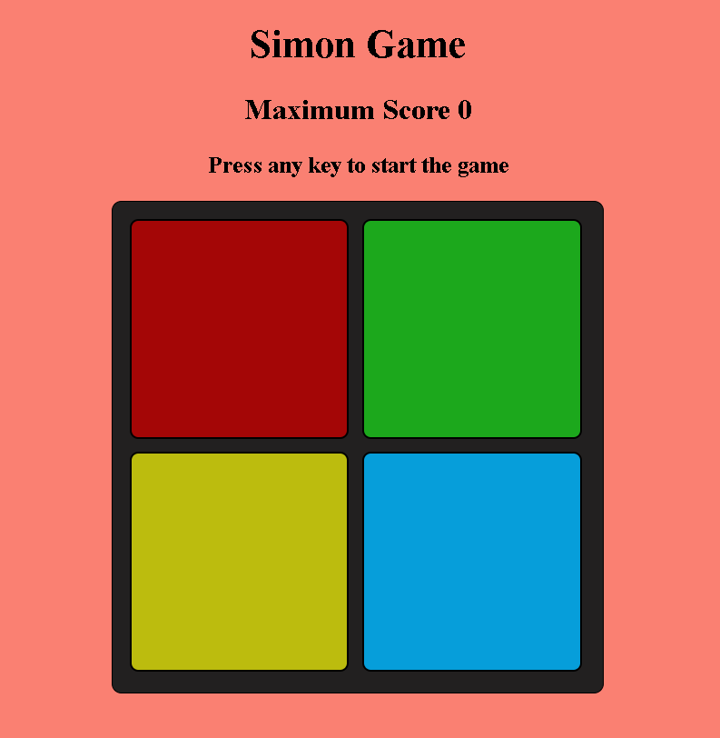

# Simon Says Game
A fun and interactive memory game built using HTML, CSS, and JavaScript.
Test your memory by repeating the color sequence shown by the game.
With each round, the pattern gets longer and more challenging!

# Features
Color pattern based gameplay.
Memory skill testing.
Game over and restart the game.

# How to play
Press any key to start the game.
Watch the color pattern that appears.
Repeat the exact pattern by clicking the buttons in the correct order.
With each level, the pattern gets longer!
Make a mistake? The game restart.

# Live Demo
Click here to play simon says game
[text](https://jeevan400.github.io/Simon-Says-Game/)

# Tech Stack
HTML
CSS
JavaScript
Git & GitHub

# Screenshots
